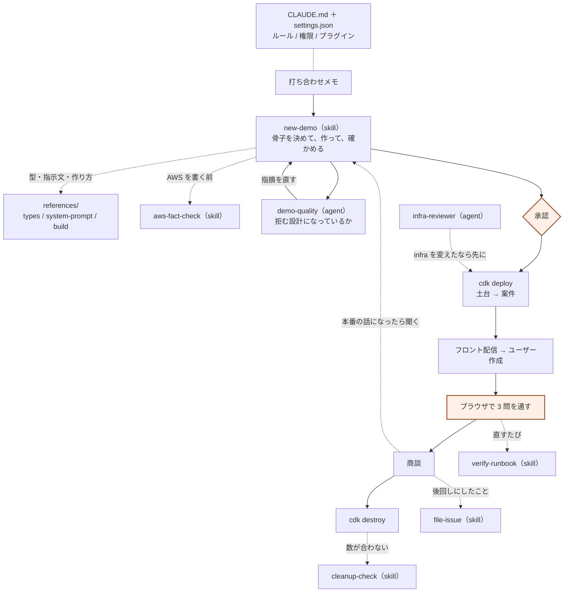
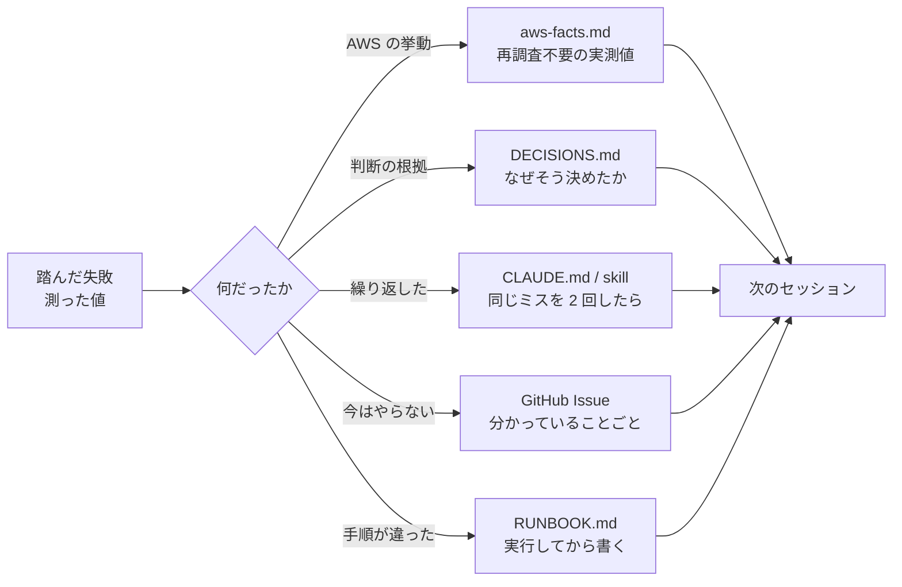

# ハーネスの全体像

打ち合わせメモから商談までを、止まらずに通すための仕掛け。
**ルールは前身と今日、実際に踏んだ失敗からしか来ていない。**

この文書は「何がどこで発火するか」と「なぜそれが在るのか」をまとめたもの。
**数字は 2026-08-15 時点**（要件書 5.7 に反するが、日付つきの棚卸しの記録として残す）。
**ハーネスを直したら、ここも直す。**

> 公開先は同じ URL を使い回す。別のセッションから更新するときは、
> Artifact に `url` としてこれを渡すこと。渡さないと別の URL が切られる。
> https://claude.ai/code/artifact/63b8cb12-a87b-4b1f-88c9-74bb2e8b0f0c

| | |
|---|---|
| skill | 6 本 |
| agent | 2 体 |
| hook | 1 個 |
| plugin | 4 個（うち 3 個が MCP を持ち込む） |
| script | 5 本 |
| 権限 | allow 43 / ask 21 / deny 13 |

---

## 常に効いている層

skill や agent は呼ばれたときだけ動く。その下に、**読み込まれた時点で効いているもの**がある。

| 層 | 何が入っているか | 共有 |
|---|---|---|
| `CLAUDE.md` | 判断の基準・守るルール・作業のルール。**毎回いちばん先に読まれる** | リポジトリ |
| `.claude/settings.json` | 権限、`AWS_REGION`、有効化するプラグイン、セッション開始フック | リポジトリ |
| `.claude/settings.local.json` | 個人の許可と skill の無効化。**`.gitignore` 済み**で、他の人には効かない | 手元だけ |
| plugins | `aws-core` / `aws-agents` / `context7` / `superpowers` | リポジトリ |

### プラグインが持ち込むもの

| プラグイン | 何が使えるようになるか |
|---|---|
| `aws-core` | MCP。AWS API の直接実行、公式ドキュメントの検索と取得、リージョン提供状況 |
| `aws-agents` | MCP。AWS ナレッジの検索。`aws-fact-check` が「載っていないものを調べる」ときの当て先 |
| `context7` | MCP。ライブラリの最新ドキュメント。CDK や Vite の書き方を推測せずに引ける |
| `superpowers` | skill。`brainstorming` / `writing-plans` / `subagent-driven-development` など。**この基盤自体がこれで設計・実装された** |

---

## いつ、何が発火するか

案件 1 件の流れと、その各段でハーネスが噛む場所。**人が要るのは 3 か所だけ。**

実線が必ず通る道、破線が条件つき。`承認` と `ブラウザで 3 問を通す` が人の担当。

---

## それぞれが在る理由

原則は「**まだ踏んでいない失敗は 1 つも入れない**」。だから各部品には、それを生んだ事故が対応する。

| 部品 | いつ | 由来した失敗 |
|---|---|---|
| `new-demo` | メモを受け取った直後 | 「答えてはいけないこと」を聞かずに作り、何でも答えるデモになった |
| `aws-fact-check` | AWS を書く前と、変えた後 | 前身で API の形を 7 箇所すべて推測で外した。2026-08-15 にモデル ID を呼ばずにコミットして 3 回続けて誤診した |
| `verify-runbook` | 手順書を書くとき | 前身で README を全部書いてから検証し、6 箇所の欠陥が出た |
| `cleanup-check` | 撤去後、数が合わないとき | User Pool がドメインを持ったまま削除に失敗し、気づかず放置された |
| `file-issue` | 「次回にしましょう」と決めたとき | 調べた結果を残さず、次のセッションが同じ AWS を建てて測り直した |
| `pre-commit-scrubber` | push の前 | 共有物にクレデンシャルや取引先名が混ざる。**2026-08-15 まで、このスキル自体がリポジトリの外にあった** |
| `demo-quality` | クライアントに見せる前 | 拒む条件と探すのをやめる条件が繋がっておらず、山場が丸ごと無効化されていた |
| `infra-reviewer` | インフラを変えた後、デプロイ前 | グローバルに一意な名前を固定し、同一アカウントに 2 つ置けなくなった |
| `session-context.py` | セッション開始時 | 消し忘れた Harness が課金され続けていることに気づかなかった |

---

## 知識がどこへ溜まるか

2 回目の案件が速かったのは、道具が増えたからではなく、**1 回目で測った値が残っていた**から。
ハーネスの本体はこちら側にある。

**溜める先を間違えると、次のセッションが同じ調査を繰り返す。**

---

## 権限は何を守っているか

守るのは 2 つだけ。それ以外は速度を優先してよい。

1. **CDK を迂回した AWS 変更**（要件書 5.1）— 追跡できなくなり、撤去漏れが課金になる
2. **公開リポジトリへの流出** — 戻せない

| | 例 |
|---|---|
| `allow` | 引数によらず安全が決まるもの（`aws * describe-*` / `list-*`、テスト、型検査、読み取り系） |
| `ask` | AWS を IaC の外で変える / 作った作業を壊す / 外に出す |
| `deny` | 資格情報を返すもの、force-push。**承認しても通す理由が無いものだけ** |

**`ask` の大半は保護ではなく意図の記録。** allow に無いものは既定で確認が入るため、
**ask が実際に守るのは allow が広いときだけ**である。

### 2026-08-15 に踏んだ 2 つ

**サービス単位のワイルドカードを入れて、塗り残しを数え損ねた。**
「60 件」と見積もったが実際は **127 件**。差の 64 件はちょうど `get-*` と `admin-get-*` で、
**安全な読み取りだと決めつけて数から外していた**。見落とした中に、このリポジトリが
実際に使う `admin-initiate-auth`（トークンを返す）が入っていた。

数え直したら、**ワイルドカード 4 つが減らす確認は 3 コマンドだけ**だった。
`describe-*` と `list-*` で大半が既に通っていたため。**3 コマンドのために 127 動詞を開けていた。**

**`python3 -c` を allow に入れた。** これは `ask` も `deny` も無効化する
（サブプロセスの中の読み書きは照合されない）。CLAUDE.md に「入れない」と書いた
**2 つ後の編集で、自分で入れていた**。

---

## 育て方

**ルールが増える一方なら、それは失敗している。** 速度を出すための基盤なので、
ブレーキばかり増やすと目的から遠ざかる。足すときは加速側から足す。

| 起きたこと | どうするか |
|---|---|
| 同じミスを 2 回した | ルールか skill にする。1 回目は運が悪かっただけかもしれない |
| 仕様を推測して外した | `aws-facts.md` に実測値を追記する |
| ルールが邪魔をした | **ルールを消す。** 守れないルールを残すと全体が形骸化する |
| 2 回守って問題が出ない | 消してよい。効いているか分からないルールを抱えない |
| 判断に迷った | `DECISIONS.md` に理由ごと残す |

**構造を前提にするルールを書かない。** ディレクトリ名・スクリプト名・ファイル形式に
依存する仕組みは、それが決まってから作る。間違った前提を強制する仕組みは、無いより悪い。

### 2026-08-15 に見えた、繰り返すパターン

**共有されているつもりで、実は手元にしかない。** 同じ形で 4 回出た。

| | クローンした人に効かなかったもの |
|---|---|
| 1 | `pre-commit-scrubber`（公開事故を防ぐルールが環境依存だった） |
| 2 | この資料（セッションの一時領域にしかなかった） |
| 3 | 手順書が必須とするコマンドの許可（各自が承認を積み直す） |
| 4 | `infra-reviewer` の案内（索引にしかなく、デプロイ時に思い出されない） |

**新しく足すものは点検するのに、既にあるものを同じ基準で見直していない。**
基準を書いたら、その基準で既存を全部洗い直すこと。

---

## 規模

| | 行数 |
|---|---|
| `RUNBOOK.md` | 716 |
| `new-demo`（参照 3 ファイル込み） | 714 |
| `aws-fact-check`（実測値と単価表込み） | 665 |
| `docs/DECISIONS.md` | 608 |
| `docs/REQUIREMENTS.md` | 435 |
| `CLAUDE.md` | 265 |
| `verify-runbook` | 194 |
| `pre-commit-scrubber` | 184 |
| `cleanup-check` | 153 |
| `file-issue` | 133 |
| `demo-quality`（agent） | 119 |
| `session-context.py`（hook） | 100 |
| `infra-reviewer`（agent） | 87 |

**ハーネスは完成品ではなく初期状態。** 踏むたびに増え、効かないと分かるたびに減る。
